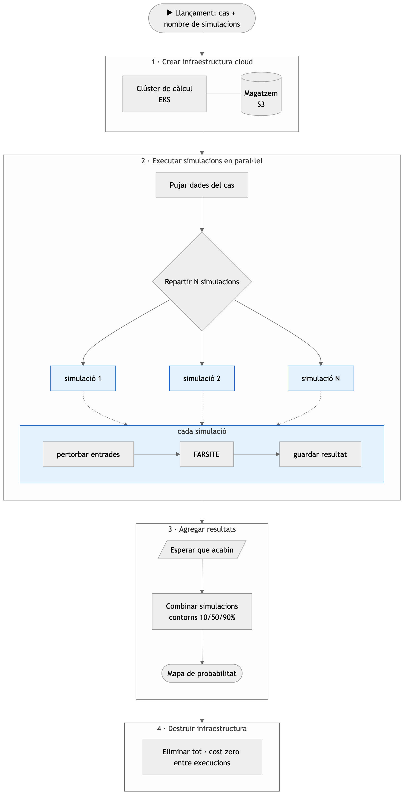

# FARSITE Monte Carlo — Cloud-Native Wildfire Ensembles

Run **thousands of FARSITE simulations in parallel on AWS** to turn a
deterministic fire-spread simulator into a probabilistic decision-support
tool.

FARSITE on its own gives one perimeter from one set of fixed inputs.
Reality is variable. This project wraps FARSITE in a containerized,
Kubernetes-driven pipeline that perturbs the inputs across N runs,
executes them in parallel on an ephemeral EKS cluster, and aggregates
the outputs into a single burn-probability map.

---

## What it is for

- Running **large Monte Carlo ensembles** (1 000 – 50 000 runs) of FARSITE
  without standing up infrastructure manually
- Producing a **burn-probability surface** instead of a single deterministic
  perimeter
- Doing it **cheap and on demand**: cluster up, run, cluster down —
  nothing left running between experiments
- Comparing the resulting probability field against real observed fire
  perimeters

Not for: real-time forecasting, suppression modelling, or replacing
operational fire-behaviour analysts. FARSITE simulates natural spread
only — no firefighters in the loop.

---

## What's in the box

| Piece | Role |
|---|---|
| **FARSITE in Docker** | Reproducible build of the C++ simulator |
| **Monte Carlo perturbation layer** | Samples wind / weather / ignition variability per run |
| **AWS EKS + S3 (Terraform)** | Ephemeral cluster + bucket, brought up and torn down per experiment |
| **Kubernetes job pipeline** | One pod per run, parallelism gated by cluster size |
| **In-cluster aggregator** | Builds the probability map from per-run outputs, only the final PNG leaves AWS |
| **Per-case configs** | Drop a `cases/case_X.env` to add a new fire — no code changes |

---

## End-to-end flow



---

## Quick start

```bash
# Provision infra (EKS + S3 + IAM)
cd terraform && terraform init && terraform apply
aws eks update-kubeconfig --region eu-west-1 --name farsite-cluster

# Run an ensemble for a given case
bash scripts/01_push_image.sh                  # build + push runner image (once per code change)
bash scripts/02_upload_inputs.sh case_7        # upload landscape + ignition + perimeter to S3
bash scripts/03_submit_jobs.sh 10000 case_7    # spawn 10 000 parallel pods
bash scripts/05_visualize_on_eks.sh 10000 case_7  # in-cluster aggregation → PNG

# Tear it down
cd terraform && terraform destroy
```

Prereqs: `docker`, `aws` CLI, `kubectl`, `terraform`, a DockerHub account.

---

## Repo at a glance

```
firemod-master/   FARSITE source + container images + pod-side scripts
generate_ensemble.py   Local ensemble generator (for testing without AWS)
cases/            One env file per fire case (case_1 … case_10)
scripts/          Pipeline driver scripts (01…06)
terraform/        Infrastructure as code (EKS, VPC, S3, IAM)
tests/            Landscape files + ignition + observed perimeters per case
```

---

## Adding a new fire case

Drop the landscape (`.lcp`), ignition shapefile and observed perimeter
shapefile into `tests/`, then create `cases/case_X.env`:

```bash
CASE_LABEL="Case X — short name"
LCP_FILE="CASE_X.lcp"
INPUT_TEMPLATE="case_X_extended.input"
IGNITION_FILE="CaseX_ignition.shp"
OBSERVED_SHP="PerN_utm"
OBSERVED_LABEL="Final observed perimeter (XXX ha)"
```

All pipeline scripts take the case name as their second argument.

---

## Author

Chengjie Peng Lin — TFG, Computer Engineering, UAB 2025/26.
