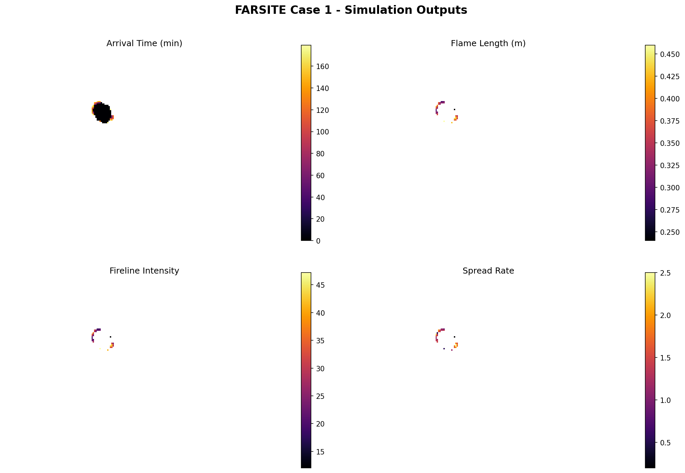
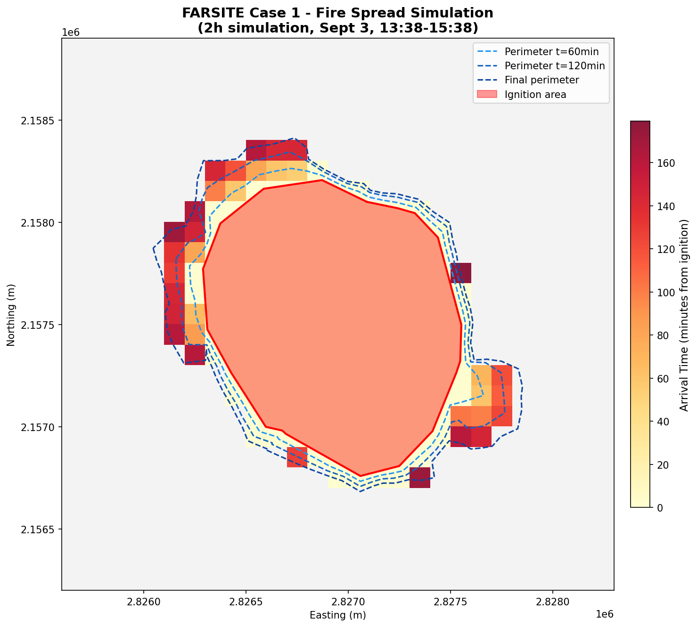
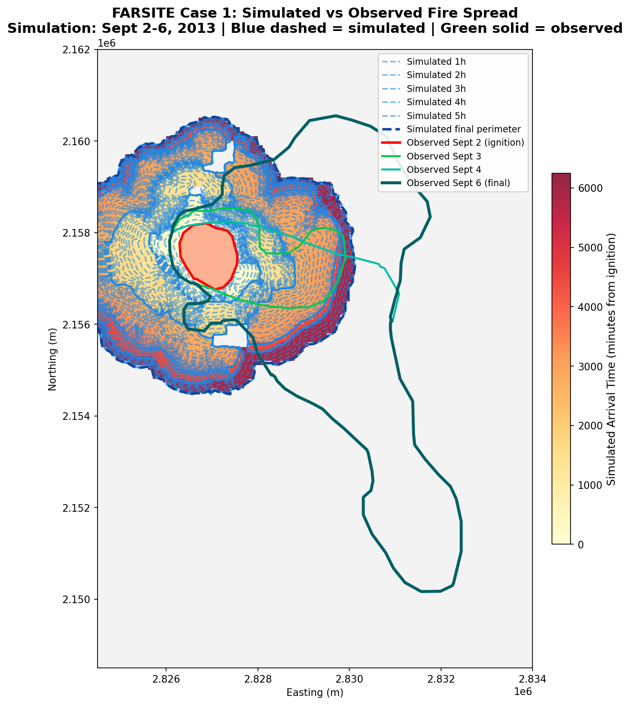

# FARSITE - Dockerized Wildfire Simulator

## What is FARSITE?

FARSITE is a **deterministic** wildfire spread simulator developed by Mark Finney (USDA Forest Service). It simulates how fire propagates across a landscape using the Rothermel model for surface fire rate of spread and Huygens' wavelet principle for fire front expansion.

Important distinction: FARSITE does not predict — it **simulates**. Given exact inputs it always produces the exact same result. There is no uncertainty or probability in a single run.

This repository contains a Linux fork of FARSITE along with test datasets, packaged inside a Docker container for portable, reproducible execution.

---

## Project Structure

```
FARSITE 5 Things/
├── firemod-master/              # FARSITE source code (C++)
│   ├── src/                     # Source files
│   ├── Makefile                 # Build configuration
│   └── Dockerfile               # Container definition
├── tests/                       # Test datasets and reference outputs
│   ├── *.lcp                    # Landscape files
│   ├── *.input                  # Simulation configuration
│   ├── *.shp/shx/dbf/prj       # Shapefiles (ignitions, barriers, perimeters)
│   ├── *.wnd / *.wtr            # Wind and weather data
│   ├── Per1_*, Per2_*, Per3_*   # Observed fire perimeters (real data)
│   └── run*.txt                 # Command files for TestFARSITE
├── visualize_v1_basic.py        # V1: raw grid heatmaps
├── visualize_v2_perimeters.py   # V2: single map with perimeters (2h sim)
├── visualize_v3_vs_observed.py  # V3: simulated vs observed (4-day sim)
├── visualize.py                 # Latest visualization script
└── .venv/                       # Python virtual environment
```

---

## What does FARSITE need to run?

FARSITE receives a **command file** (`.txt`) that points to the simulation inputs:

```
[LCP] [InputsFile] [IgnitionShp] [BarrierShp] [outputPath] [outputType]
```

These inputs are:

### 1. Landscape file (`.lcp`)
A binary raster where each cell (e.g. 100x100m) contains: elevation, slope, aspect, fuel model, canopy cover, canopy height, canopy base height, and canopy bulk density. This is the terrain the fire burns on.

### 2. Inputs file (`.input`)
The simulation configuration. Contains:
- **Simulation window**: start time, end time, timestep
- **Fuel moisture**: humidity values per fuel model (1h, 10h, 100h, live herb, live woody)
- **Weather data**: daily records of temperature, humidity, precipitation
- **Wind data**: records every few hours with speed, direction, and cloud cover
- **Simulation parameters**: spatial resolution, spotting probability, acceleration, crown fire method, etc.

### 3. Ignition shapefile (`.shp`)
A point or polygon that defines where the fire starts.

### 4. Barrier shapefile (optional)
Roads, rivers, or firebreaks that stop fire spread. Use `0` if none.

In summary: **terrain + weather + where the fire starts**. With that, FARSITE calculates how the fire spreads.

---

## Dockerization

### Why Docker?

FARSITE is C++ code that requires `g++` to compile. By containerizing it we get:

- No need to install compilers or dependencies on the host machine
- Identical results on any OS (macOS, Linux, Windows)
- Isolated, reproducible runs ready for ensemble execution at scale

### How the Dockerfile works

We use a **multi-stage build** to keep the final image small:

**Stage 1 (builder)** — Uses `gcc:12` image (~1.3GB) to compile the source code with `make`.

**Stage 2 (final)** — Uses `debian:bookworm-slim` (~80MB), copies only the compiled binary `TestFARSITE`. No compiler, no source code, just the executable and the C++ standard library (`libstdc++6`).

### Source code fix

The original code has a pointer comparison in `src/Farsite5.cpp:1565` that GCC 12 rejects:

```cpp
// Before (invalid in modern C++)
if (perimeter1[NumFire] && perimeter1[NumFire] > 0)

// After
if (perimeter1[NumFire] != NULL)
```

The original code compared a `double*` pointer with integer `0` using `>`, which is undefined behavior. Both conditions were checking the same thing (non-null pointer), so the fix simplifies it to a single null check.

---

## Usage

### Build the image

```bash
cd firemod-master
docker build -t farsite .
```

### Run a simulation

```bash
docker run --rm \
  -v "/path/to/your/data:/data/input" \
  -v "/path/for/results:/data/output" \
  farsite /data/input/command_file.txt
```

- `[BarrierShp]` = `0` if no barriers
- `[outputType]` = `0` (both), `1` (ASCII grid), `2` (FlamMap binary)

### Example with test data

```bash
docker run --rm \
  -v "./tests:/data/input" \
  -v "./tests/output:/data/output" \
  farsite /data/input/runcase_1_docker.txt
```

---

## Outputs

Each simulation generates ASCII grids (`.asc`) and FlamMap binary grids (`.fbg`). These are spatial rasters — each cell holds a numeric value for the area it covers.

| File | What it tells you |
|------|-------------------|
| `*_ArrivalTime.asc` | When the fire reached each cell (minutes from ignition) |
| `*_FlameLength.asc` | Height of the flame at each cell |
| `*_Intensity.asc` | Energy released per meter of fire front |
| `*_SpreadRate.asc` | How fast the fire was moving at each point |
| `*_SpreadDirection.asc` | Which direction the fire was heading |
| `*_CrownFire.asc` | Whether fire reached the tree canopy |
| `*_HeatPerUnitArea.asc` | Total heat released per unit area |
| `*_ReactionIntensity.asc` | Rate of energy release in the combustion zone |
| `*_Perimeters.shp` | Fire perimeter as a vector shapefile |
| `*_Spots.*` | Location of spot fires (embers landing ahead of the front) |
| `*_Timings.txt` | Run configuration summary and execution time |

Cells with value `-9999` indicate areas where the fire did not arrive.

The output files are the same spatial grid format as the inputs — same coordinate system, same cell size — but instead of describing **what is there** (fuel, elevation), they describe **what happened** (when the fire arrived, how intense it was).

---

## Visualization

### Setup

```bash
python3 -m venv .venv
.venv/bin/pip install numpy matplotlib pyshp
```

### V1: Raw output grids (`visualize_v1_basic.py`)

The first step was understanding what FARSITE produces. Each `.asc` file is a grid of numbers — not very intuitive. This script renders the four main outputs as separate heatmaps.

```bash
.venv/bin/python3 visualize_v1_basic.py
```



Each panel shows a different variable:
- **Arrival Time** — When the fire reached each cell (the "shape" of the fire expansion)
- **Flame Length** — Height of flames at each burned cell
- **Fireline Intensity** — Energy released per meter of fire front
- **Spread Rate** — Speed of fire propagation

The black area is the fire footprint. Everything else (`-9999`) is where the fire didn't reach. The simulation was only 2 hours long (Sept 3, 13:38-15:38), so the burned area is small.

### V2: Single map with perimeters (`visualize_v2_perimeters.py`)

Having 4 separate technical maps is hard to interpret. This version combines everything into a single map showing the fire expansion with perimeter outlines.

```bash
.venv/bin/python3 visualize_v2_perimeters.py
```



What you see:
- **Red fill** — Where the fire started (ignition area, Sept 2)
- **Yellow-to-red gradient** — The area burned, colored by arrival time (lighter = arrived later)
- **Blue dashed lines** — Simulated perimeters at 60min and 120min, showing the fire's expansion over time

### V3: Simulated vs observed (`visualize_v3_vs_observed.py`)

The test dataset contains **real observed fire perimeters** from an actual wildfire (Sept 2-6, 2013). The `Per1_`, `Per2_`, `Per3_`, `Per4_` shapefiles represent where the fire actually was on each date.

For this comparison, we extended the simulation from 2 hours to 4 days (Sept 2-6) by modifying the input file:

```
FARSITE_START_TIME: 09 02 1200
FARSITE_END_TIME: 09 06 2300
```

```bash
.venv/bin/python3 visualize_v3_vs_observed.py
```



What you see:
- **Red fill** — Ignition area (observed Sept 2)
- **Yellow-to-red gradient** — Simulated fire expansion over 4 days
- **Blue dashed lines** — Simulated perimeters at each timestep
- **Green solid lines** — **Real observed perimeters** (Sept 3, 4, and 6)

---

## Analysis: Simulated vs Reality

The comparison reveals important differences:

### Shape
FARSITE simulated a nearly **circular expansion** in all directions. The real fire was much more **elongated toward the south/southeast**, forming a "tongue" that extended far from the ignition point.

### Direction
The real fire was clearly pushed by a dominant wind direction toward the southeast. FARSITE did not capture this asymmetry well — the fixed wind inputs don't fully represent what actually happened over those 4 days.

### Size
The real fire perimeter on Sept 6 extends much further southeast than FARSITE simulated. But in the north/west, FARSITE **overestimated** — it simulated fire in areas where it didn't actually reach.

### Why the difference?
A single deterministic run uses **fixed inputs** (exact wind speed, exact humidity, exact fuel moisture). Reality is much more variable — wind shifts, gusts, local humidity changes, terrain effects. One set of fixed inputs can never fully capture what actually happened over 96 hours.

---

## What's next: Monte Carlo and probabilistic simulation

The comparison above demonstrates why a single deterministic simulation is insufficient. The solution is to run **hundreds or thousands of simulations** with controlled variations in the inputs — a Monte Carlo approach.

Instead of saying "wind is 5 mph from the northwest", we say "wind is 5 mph +/- 3 mph, direction 315 +/- 30 degrees" and sample from those distributions.

The key parameters to perturb:
1. **Wind speed and direction** — The most impactful variable. Varying wind direction would produce simulations that expand toward the southeast (matching reality) as well as other directions
2. **Fuel moisture** — Drier fuel = faster spread, wetter fuel = slower
3. **Spotting probability** — Controls how far embers jump ahead of the fire front

By superimposing all simulation results, we get a **burn probability map**:
- Cells near the ignition burn in almost every simulation (high probability)
- Cells far away in the dominant wind direction burn in some simulations (medium probability)
- Cells in unexpected directions burn in few simulations (low probability)

This probability surface would **envelope** the real observed perimeter rather than trying to match it with a single guess. The goal is not to predict exactly where the fire will go, but to quantify the **likelihood** of fire reaching each location.

This is the transition from deterministic simulation to **stochastic ensemble system**, as defined in the project's `CLAUDE.md`.
